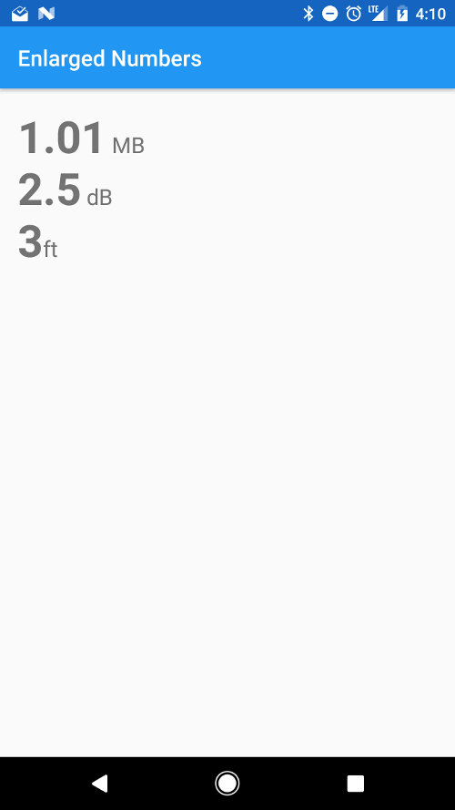

# Enlarged Numbers Spannable



This is a little library for enlarging the size of numbers, compared to the rest of the text in your `TextView`.

It is good for demonstraiting the usage of `Spannable` and how they can be combined to create very different text effects. `Spannable` can be very helpful in Android. I use a similar idea in my [TextView-LinkBuilder](https://github.com/klinker24/Android-TextView-LinkBuilder) project.

I would like to a blog post, in the future, about this type of thing.

## Features

This libary enlarges the size of numbers within a `CharSequence/String`. Basically, you pass a string of text, through the `Factory`, and it will output a `SpannableString` that doubles the text size of numbers, as well as bolds them.

This can create nice effects, especially when you have a number, along with a representation, such as `12 MB` or `1.57 dB`.

The goal of this library is just to make that effect very simple to work with and to show how `Spannable` can be used within your own project, in other ways.

## Installation

There are two ways to use this library:

#### As a Gradle dependency

This is the preferred way. Simply add:

```groovy
dependencies {
    compile 'com.klinkerapps:enlarged_numbers:1.0.0'
}
```

to your project dependencies and run `gradle build` or `gradle assemble`.

#### As a library project

Download the source code and import it as a library project in Eclipse. The project is available in the folder **library**. For more information on how to do this, read [here](http://developer.android.com/tools/projects/index.html#LibraryProjects).

## Example Usage

Functionality can be found in the example's [MainActivity](https://github.com/klinker24/Android-EnlargedNumbers-Spannable/blob/master/example/src/main/java/xyz/klinker/enlarged_numbers_example/MainActivity.java). It is extremely simple to use:

```java
EnlargedNumbersString str = EnlargedNumbersFactory.build(getString(R.string.test_string), 1.5, false);
textView.setText(str);
```

The `build` method accepts a required `CharSequence`, then an optional number scale multiplier and flag for whether or not the number should be bolded.

## Contributing

Please fork this repository and contribute back using [pull requests](https://github.com/klinker24/Android-EnlargedNumbers-Spannable/pulls). Features can be requested using [issues](https://github.com/klinker24/Android-EnlargedNumbers-Spannable/issues). All code, comments, and critiques are greatly appreciated.

## Changelog

The full changelog for the library can be found [here](https://github.com/klinker24/Android-TextView-LinkBuilder/blob/master/changelog.md).


## License

    Copyright 2015 Luke Klinker

    Licensed under the Apache License, Version 2.0 (the "License");
    you may not use this file except in compliance with the License.
    You may obtain a copy of the License at

       http://www.apache.org/licenses/LICENSE-2.0

    Unless required by applicable law or agreed to in writing, software
    distributed under the License is distributed on an "AS IS" BASIS,
    WITHOUT WARRANTIES OR CONDITIONS OF ANY KIND, either express or implied.
    See the License for the specific language governing permissions and
    limitations under the License.
